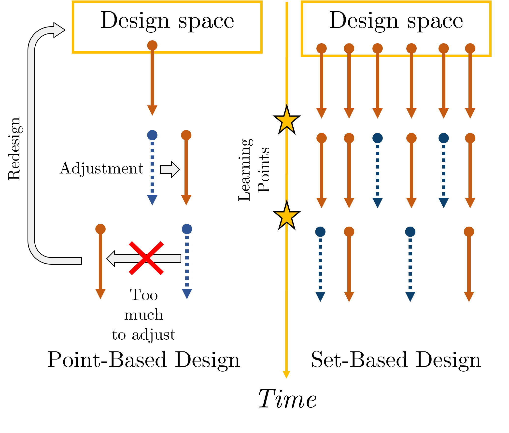
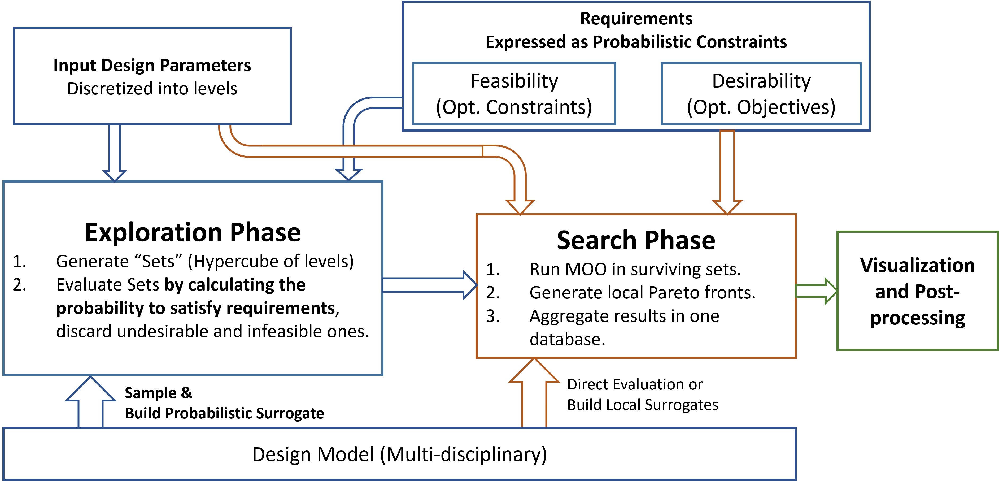
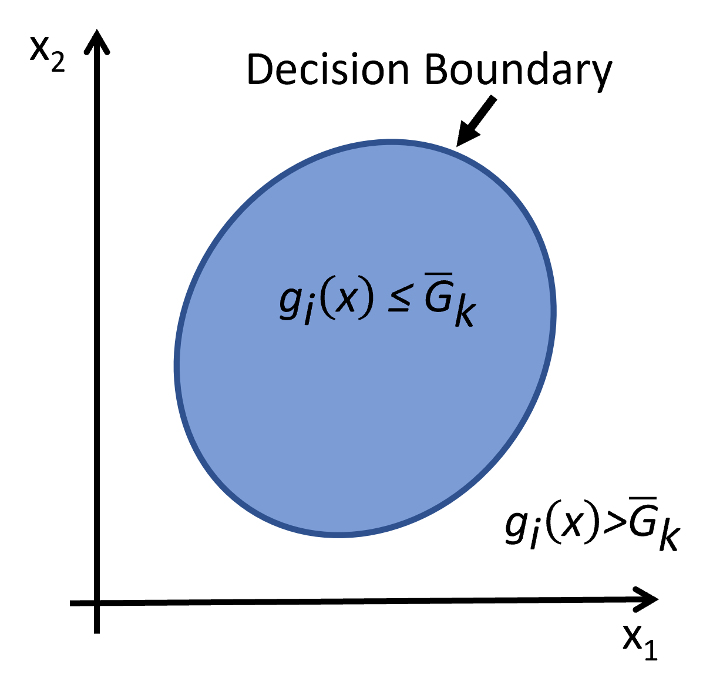
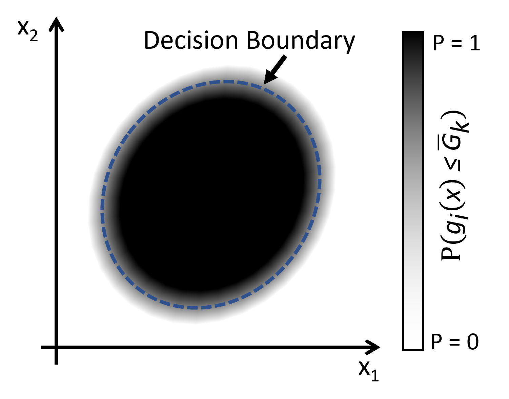
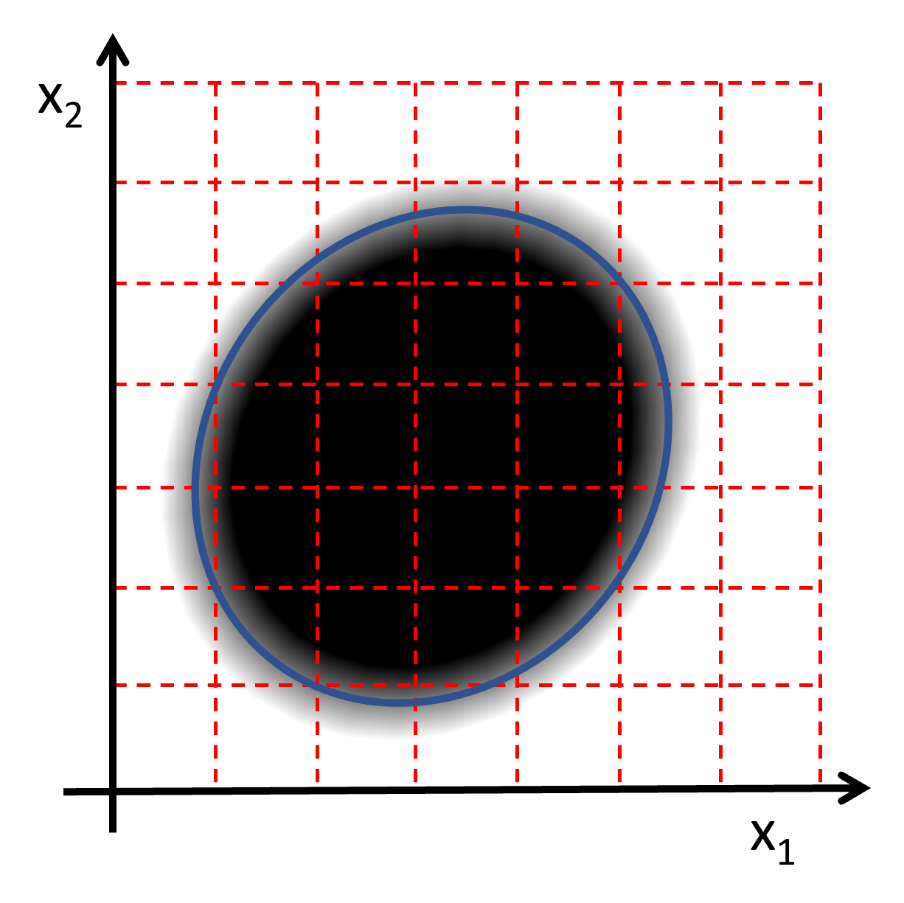
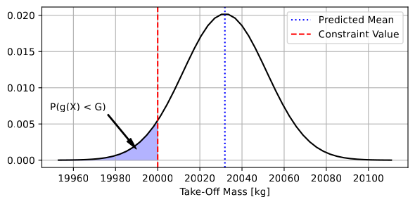

---
title: 'PDOPT: A Python library for Probabilistic Design space exploration and OPTimisation.'
tags:
  - Python
  - Computational Engineering
  - Design Space Exploration
  - Set-Based Design
  - Design Uncertainty
  - Multi-Objective Optimization
authors:
  - name: Andrea Spinelli
    orcid: 0000-0002-3064-3387
    corresponding: true
    affiliation: 1
  - name: Timoleon Kipouros
    orcid: 0000-0003-3392-283X
    affiliation: 1
affiliations:
 - name: Centre for Propulsion and Thermal Power, Cranfield University, MK430AL, UK
   index: 1
date: 22 August 2023
bibliography: paper.bib
---

# Summary

Contemporary engineering design is characterised by products and systems with increasing complexity coupled with tighter requirements and tolerances. This leads to high epistemic uncertainty due to numerous possible configurations and a high number of design parameters. Set-Based Design is a methodology capable of handling these design problems, by exploring and evaluating as many alternatives as possible, before committing to a specific solution. 

The Python package `PDOPT` aims to provide this capability without the high computational cost associated with the factorial-based design of experiments methods. Additionally, `PDOPT` performs the requirement mapping without explicit rule definition. Instead, it utilizes a probabilistic machine learning model to identify the areas of the design space most promising for user-provided requirements. This yields a plethora of feasible design points, assisting designers in understanding the system behaviour and selecting the desired configurations for further development.

# State of the field

Engineering design is a process where needs, quantitative and qualitative, are transformed into a set of specifications (e.g. geometry, materials, component list, etc) such that they can be sufficiently satisfied. The procedure involves performing several analyses of the system under design through suitable modelling tools, which map the design parameters to the quantified needs, and carrying out decisions to narrow and identify the range of desirable parameters. To aid this procedure, the designer relies on computer simulations through optimisation methods or the design of experiments in the design space.

Historically, optimisation has been used in the late stages of design, to refine a solution already in the ballpark of the requirements. However, with the development of Multi-disciplinary Optimisation (MDO), there has been increasing interest in bringing optimisation in earlier stages of the design process. Searching for optimal designs with concurrent analysis of different disciplines allows one to obtain better results than with sequential optimisation alone, reducing the time and cost of the development cycle [@MartinsLambe2013].
In the conceptual phase, optimisation can be employed to understand which combination of input design parameters enables to satisfy the requirements. The algorithm acts by changing the input quantities iteratively to find the ideal combination(s) that minimise/maximise quantities of interest (often performance targets) without violating the problem constraints (which can be technological, geometrical, economical, and so on). Population-based solvers such as Genetic Algorithm [@DebNSGA:2002] or Particle Swarm [@Kennedy1995] are best suited for this task as they evolve multiple design points in parallel, rather than iteratively improving a single solution [@Deb2008]. The result is a family of points, covering the design space which are optimal. Surrogate modelling [@Forrester2009] is often introduced to reduce the computational cost of each functional evaluation and correct with high-fidelity data fast low-fidelity models often used in the conceptual design phase [@Kontogiannis2020].

Software libraries developed for optimisation in Python are the OpenMDAO framework, which focuses on multi-disciplinary optimisation [@Gray2019a], the Object-Oriented `pyOpt` [@Pyopt], the `DEAP` evolutionary optimisation library [@DEAP], and `pymoo` multi-objective optimisation library [@pymoo]. These libraries are open-source and general-purpose.

While effective in finding the desired set of design points, optimisation methods are required to properly set up the problem to deliver meaningful results. This may be difficult at the beginning of the design procedure, as needs may be not fully defined, and the behaviour of the model not be fully understood. Design of Experiments methods can assist in initiating this process through sampling and evaluation of the design space to obtain an understanding of the system response. Traditionally this approach is carried out through factorial sampling, where all possible combinations of extreme parameter values are tested [@MontgomeryDE]. A response surface would then be built for analysing the response of the system inside the interval. This approach is feasible when the number of variables is low, as the number of experiments to be carried out grows exponentially. In the computational engineering field, quasi-random sampling is preferred, with Latin Hypercube sampling and Sobol sequences being most used [@Yondo2018]. These allow for training surrogate models for design exploration with a lower number of points in cases where factorial design would require an unfeasible amount.

Examples of libraries useful for performing the design of experiments are the Quasi-Monte Carlo sampling module `scipy.qmc` and the University of Michigan’s Surrogate Modelling Toolbox [@saves2024smt]. Unlike an optimisation problem, there is no fixed procedure to obtain the mapping of the requirements on the input parameters. The designer is free to play with the model, with the aid of visualisation methods to understand the problem at hand.

{ width=75% }

The framework presented in this paper attempts to combine the two approaches in a single framework through the application of the principles of Set-Based Design (SBD) and Bayesian probability. SBD is a design practice that focuses on narrowing down the input design space by eliminating the candidate designs that do not satisfy the needs and requirements [@singer2009set]. It was originally developed by Ward [@ward1993sbd] and it is commonly associated with the Toyota Production System [@sobek1996sbdToyota]. Figure \autoref{fig:sbd_process} compares SBD with the traditional iterative design process. Focusing on eliminating the unfeasible and undesirable designs from the candidate pool rather than selecting one to refine leads to a more robust design cycle [@mckenney2011adapting].

SBD is used in `PDOPT` for performing an initial assesment of the design space and restriction to the most promising portions, which are then evaluated with local MDO problems. Georgiades previously developed a framework combining SBD and MDO named `ADOPT` [@ADOPT_paper], of which `PDOPT` is a development. The difference is in the set-elimination process. `ADOPT` used expert-defined rules that mapped the input parameters to the quantities of interest. This approach is robust in case of well understood design problems, but limited for unconventional systems, of which there is no best practices to draw from. `PDOPT` overcomes this limitation by applying Bayesian probability [@bernardo2009bayesian] as a selection criterion and assuming the underlying MDO model is a source of knowledge for the set elimination process. By casting the requirements in a probabilistic statement (i.e. "What is the probability it is satisfied?") and sampling in each set using surrogate models, it is possible to estimate the likelihood a set can satisfy all the requirements simultaneously and, therefore, worthy of further analysis. The advantage of this methodology is not having to rely on additional hardcoded rules on top of the implicit assumptions in the MDO model. 

# Statement of need

`PDOPT`, short for Probabilistic Design and OPTimisation, is a Python package for design space exploration of systems under design. It implements a set-based approach for mapping the requirements to the design space, using a probabilistic surrogate model trained on the provided design model. This procedure ensures to identification of the best candidate areas of the design space with the minimum number of assumptions of the design of the system.

The API of `PDOPT` was designed as a library with class-based interfaces between the components of the framework. This ensures both flexibility and transparency, as the user can inspect the main data structure between the phases of the framework. A full `PDOPT` analysis consists of two phases: the Exploration phase and the Search phase. These are shown in Figure \autoref{fig:pdopt_chart}. The first one surveys the design space to identify the areas that are most likely to satisfy the constraints over the quantities of interest of the model. The second phase introduces a multi-objective optimisation problem in each surviving set for recovering the individual design points. The result is multiple local Pareto fronts, one for each set.

The fundamental idea behind the Exploration phase is to map the requirements without rule elicitation, instead relying on the design model provided for the Search phase. The assumption is the design model contains implicitly the knowledge necessary to map the quantities of interest to the input parameters. The mapping procedure mathematically is equivalent to identifying the domain where each constraint is true. The edge of this domain is the decision boundary of that constraint (Fig. \autoref{fig:db_1}).

{ height=30% }

The set-based procedure consists of breaking down the design space into discrete portions to be evaluated. Sets crossed by the decision boundary are difficult to evaluate in a boolean way. This is avoided by reformulating the statement (i.e. the inequality must be true) as a probabilistic one to be interpreted in a Bayesian way (i.e. "What is the probability the inequality is true?"). This allows a fuzzy margin around the decision boundary and enables to inclusion of sets that would otherwise be hard to select or discard, as shown in Figures \autoref{fig:db_2} and \autoref{fig:db_3}. 

{ height=30% }

{ height=30% }

Casting the requirements in probabilistic form also enables requirement mapping without the need for explicit rules.  Instead, by sampling the set and evaluating the points with a Gaussian Process Regressor, it is possible to estimate the probability of requirement satisfaction. Each evaluated point has a mean and variance of the quantity of interest subject to the constraint. The k-th point probability of satisfaction of the i-th requirement is then calculated as:

$$P^k(y_i < \overline{g_i}) = \Phi \left ( \frac{\overline{g_i} - \mu_i^k}{\sigma_i^k} \right )$$

where $\overline{g_i}$ is the value of the value of the decision boundary. This calculation is visualised in \autoref{fig:req_prob}. 

{ width=80% }

The probability of the whole set is calculated by counting how many points were able to satisfy the requirement over the total number of samples:

$$ P_{i} = \frac{n_{i,sat}}{N_{samples}} $$

Multiple requirements are aggregated by assuming conditional independence, thus multiplying them together. Sets are then discarded if their overall probability is lower than the threshold for acceptance. Surviving sets are passed to the Search phase for local MDO. The design points obtained from the local MDO problems yield both the global Pareto front and the feasible suboptimal points. Interactive visualisation tools can be used to analyse the results and proceed with design selection. Thanks to the probabilistic mapping of the requirements to the design space, the computational cost for design space exploration can be reduced by up to 80% [@SpinelliEASN:2021], as the unfeasible sets are evaluated with the multi-disciplinary optimisation code.

`PDOPT` is intended to be used by researchers and engineers alike in developing complex engineering systems. It has been developed within the FutPrint50 project [@fp50] and released as open-source software under the MIT license. The software has been used in several scientific publications regarding the design of hybrid-electric aircraft [@SpinelliMDPI:2022], and the effects of operating conditions [@SpinelliEASN:2022] and technological uncertainty [@SpinelliAIAA:2023] on the design.

# Availability

`PDOPT` can be found on GitHub [@pdoptrepo] and is compatible with the latest Python release. The release includes a PDF manual as a user guide and API reference. An example test set-up is also provided in the GitHub repository. Dependencies include the standard Python scientific stack (`numpy`, `scipy`, `pandas`, `matplotlib`) with the addition of the `scikit-learn` machine learning library, the `pymoo` multi-objective optimisation framework [@pymoo], and the `joblib` parallelisation library. As an optional feature, `plotly` can be installed to take advantage of the prototypical decision-making environment packaged with the library.   

# Acknowledgements

The authors thank the FutPrInt50 researchers for their collaboration and contributions
to the software and test case applications. This project has received funding from the European Union’s Horizon 2020 Research and Innovation program under Grant Agreement No 875551.

# References